# 🌐 SifNet - Plataforma de Comercio Electrónico

SifNet es una plataforma moderna de comercio electrónico desarrollada con React y Vite, diseñada para ofrecer soluciones tecnológicas y servicios de red. La aplicación incluye un catálogo de productos, carrito de compras, sistema de administración y características avanzadas de SEO y accesibilidad.

## ✨ Características Principales

- 🛍️ **Catálogo de Productos**: Navegación intuitiva con filtros y búsqueda
- 🛒 **Carrito de Compras**: Gestión completa de productos seleccionados
- 👤 **Sistema de Autenticación**: Login seguro con roles de usuario
- 🔧 **Panel de Administración**: Gestión de productos y categorías
- 📱 **Diseño Responsive**: Optimizado para móviles y escritorio
- ♿ **Accesibilidad Web**: Cumple con estándares WCAG 2.1
- 🔍 **SEO Optimizado**: Meta tags dinámicos con React Helmet
- 💰 **Multi-Moneda**: Sistema configurable de monedas (USD por defecto)
- 📞 **Integración WhatsApp**: Envío directo de pedidos

## 🛠️ Tecnologías Utilizadas

- **Frontend**: React 19, Vite
- **Estilos**: Tailwind CSS, CSS personalizado
- **UI Components**: Lucide React (iconos)
- **Carrusel**: React Slick
- **Notificaciones**: Sonner
- **SEO**: React Helmet Async
- **Routing**: React Router DOM

---

## 📋 Requisitos del Sistema

- **Node.js**: v18.0.0 o superior
- **npm**: v8.0.0 o superior
- **Sistema Operativo**: Windows, macOS, Linux

---

## ⚡ Instalación

### 1. Clonar el Repositorio

```bash
git clone https://github.com/josmanjp/sifnet.git
cd sifnet
```

### 2. Instalar Dependencias

```bash
npm install
```

### 3. Configurar Variables de Entorno

Copia el archivo de ejemplo y configura las variables:

```bash
cp .env.example .env
```

Edita el archivo `.env`:

```env
# Configuración de API
Colocar aca la url de la api donde se aloja el backend, en el repositorio esta una api totalmente funcional con esta pagina alojado en una VPS


VITE_API_URL=http://localhost:3006/api

# Configuración de Moneda
VITE_CURRENCY=USD
VITE_CURRENCY_SYMBOL=$
```

### 4. Instalar Dependencias con Resolución de Conflictos

Si encuentras problemas con las dependencias, utiliza:

```bash
npm install --legacy-peer-deps
```

### 5. Ejecutar en Modo Desarrollo

```bash
npm run dev
```

La aplicación estará disponible en: `http://localhost:5173`

### 6. Construir para Producción

```bash
npm run build
```

### 7. Vista Previa de Producción

```bash
npm run preview
```

---

## 📁 Estructura del Proyecto

```
sifnet/
├── public/                 # Archivos estáticos
│   ├── assets/            # CSS, imágenes, fuentes
│   └── index.html
├── src/
│   ├── components/        # Componentes React reutilizables
│   │   ├── Header.jsx
│   │   ├── Footer.jsx
│   │   ├── ProductCard.jsx
│   │   ├── Cart.jsx
│   │   └── ...
│   ├── pages/            # Páginas principales
│   │   ├── HomePage.jsx
│   │   ├── CatalogPage.jsx
│   │   ├── ProductPage.jsx
│   │   └── Admin*.jsx
│   ├── context/          # Context API
│   │   ├── AuthContext.jsx
│   │   └── CartContext.jsx
│   ├── utils/            # Utilidades y helpers
│   │   ├── api.js
│   │   └── currency.js
│   ├── styles/           # Estilos personalizados
│   └── App.jsx          # Componente principal
├── .env                 # Variables de entorno
├── package.json        # Dependencias y scripts
└── README.md          # Documentación
```

---

## 📚 Manual de Usuario

### 🏠 **Página Principal (Homepage)**

La página de inicio presenta:
- **Hero Section**: Mensaje principal y llamada a la acción


- **Sección de Características**: Estudios y servicios ofrecidos

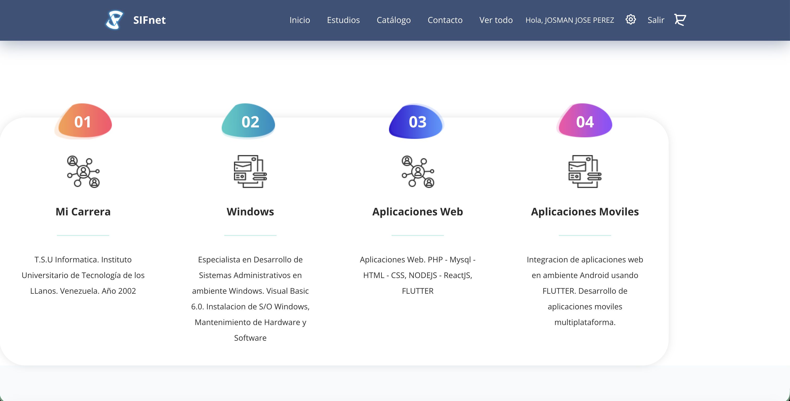


- **Catálogo Destacado**: Productos más populares en carrusel

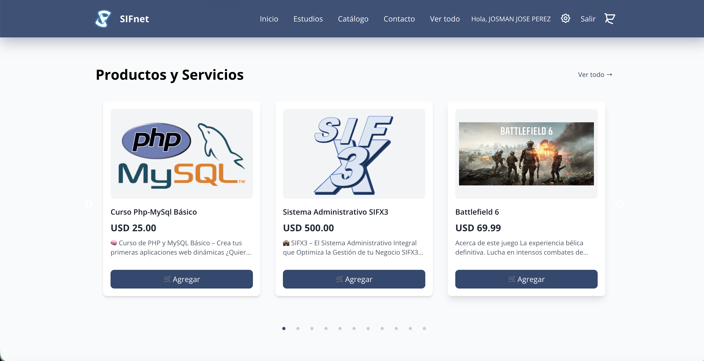

- **Información de Contacto**: Datos de la empresa

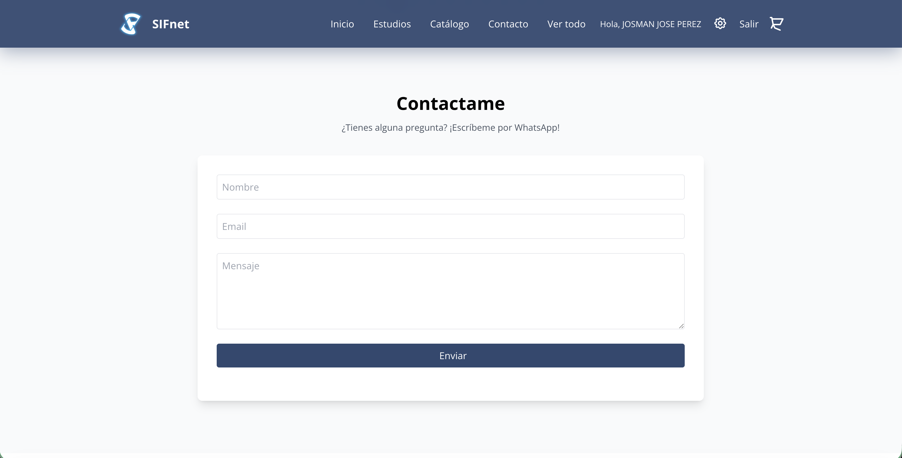

*Navegación*: Usa el menú superior para acceder a diferentes secciones o haz scroll para explorar.


### 🛍️ **Catálogo de Productos**

**Acceso**: Click en "Ver todo" o "Catálogo" en el menú principal.

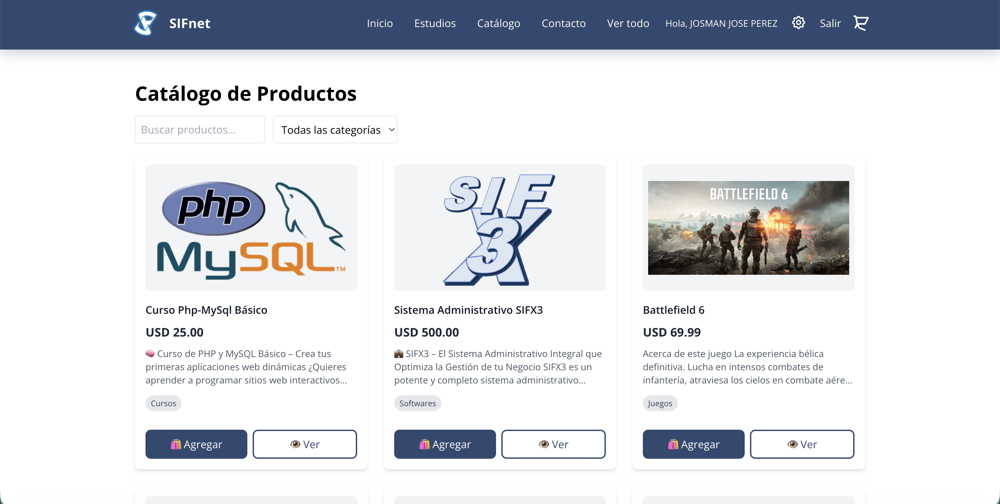

**Características**:
- **Filtros por Categoría**: Selecciona categorías específicas

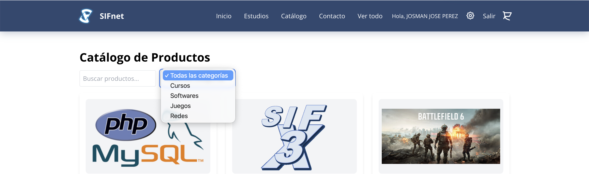


- **Búsqueda**: Campo de búsqueda en tiempo real

- **Grid Responsive**: Adaptado para móviles y escritorio

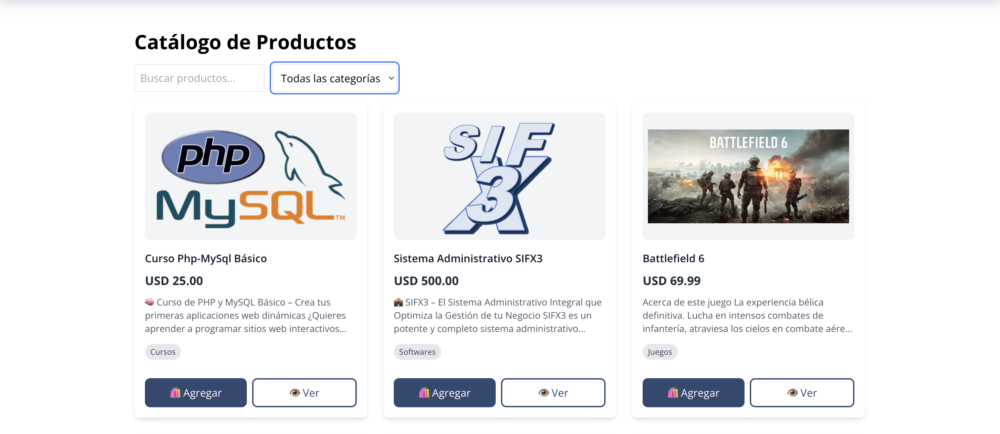


- **Información del Producto**: Precio, descripción, categoría

**Uso**:
1. Utiliza la barra de búsqueda para encontrar productos específicos
2. Filtra por categoría usando el selector desplegable
3. Click en "Agregar" para añadir al carrito
4. Click en "Ver" para detalles completos del producto
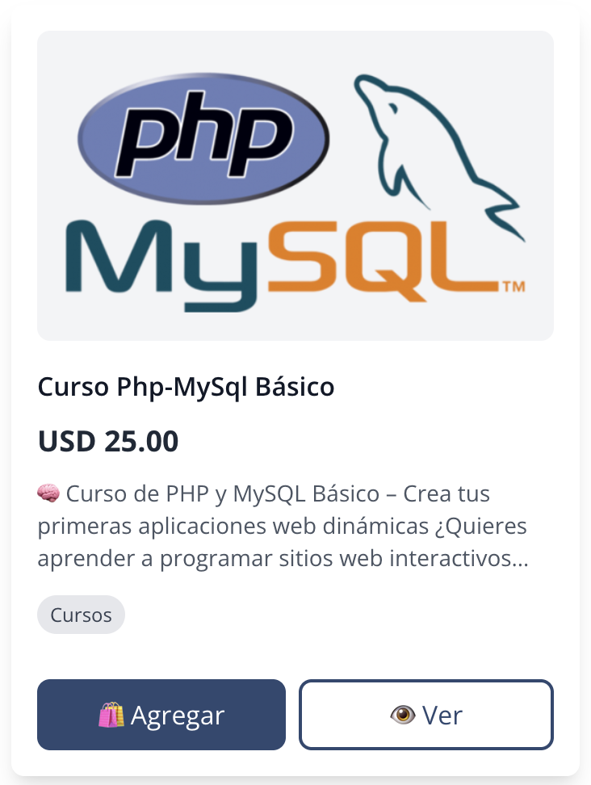

### 📱 **Vista de Producto Individual**

**Acceso**: Click en "Ver" desde cualquier producto.
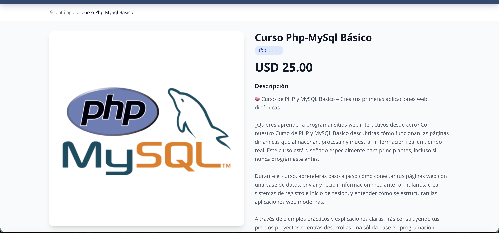
**Información Disponible**:
- Imagen del producto en alta calidad
- Nombre y descripción detallada
- Precio en USD
- Categoría del producto
- Selector de cantidad
- Botones de acción (Agregar al carrito, Comprar ahora)

**Breadcrumb Navigation**: Usa el link <- Catalogo links para regresar al catálogo.


### 🛒 **Carrito de Compras**

**Acceso**: Click en el ícono del carrito en el header.


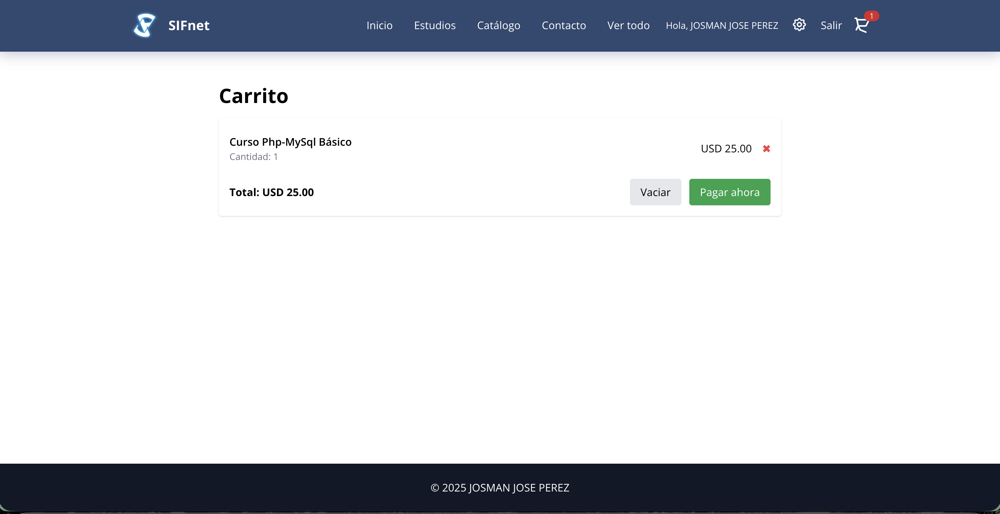
**Funcionalidades**:
- **Ver Productos**: Lista completa de productos agregados
- **Modificar Cantidades**: Botones + y - para ajustar
- **Eliminar Productos**: Botón X para remover items
- **Total Dinámico**: Cálculo automático en USD
- **Enviar por WhatsApp**: Integración directa para pedidos

**Proceso de Compra**:
1. Revisa los productos en tu carrito
2. Ajusta cantidades si es necesario
3. Click en "Pagar Ahora"

4. Se abrirá WhatsApp con el pedido pre-formateado

### 👤 **Sistema de Login**

**Acceso**: Click en "Ingresar" en el header.

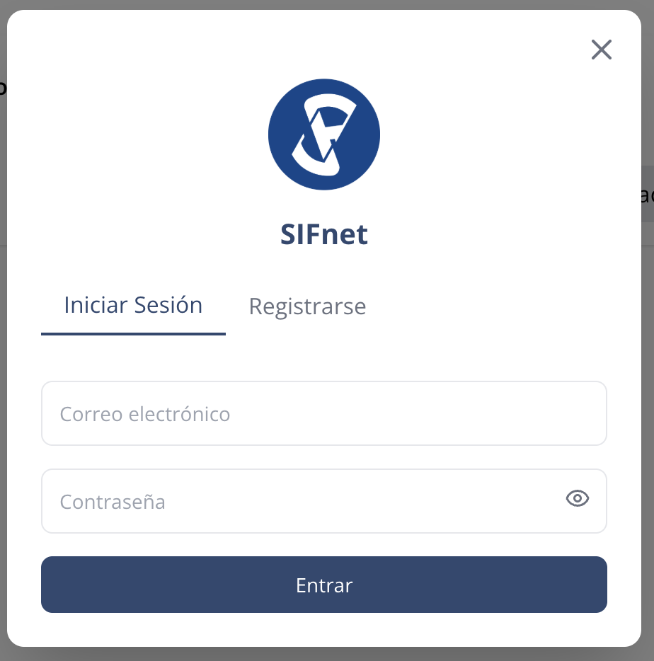

**Tipos de Usuario**:
- **Usuario Regular**: Acceso básico a compras
- **Administrador del Sistema**: Acceso completo al panel admin

**Proceso Login**:
1. Ingresa credenciales en el modal de login
2. Sistema valida automáticamente
3. Redirección según tipo de usuario

**Proceso Registro**:
1. Selecciona la pestaña Resgistrarse
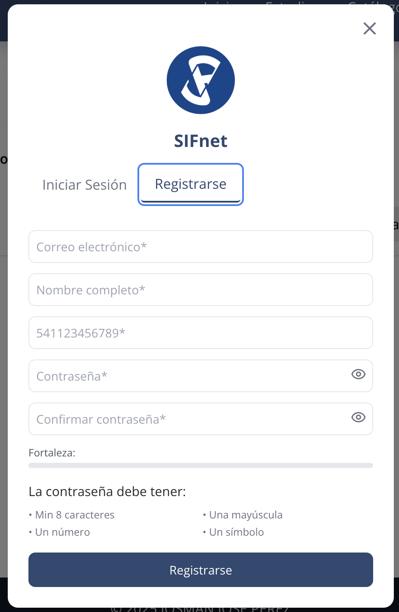

2. Ingresa los Datos que solicita el formulario
3. Sistema valida automáticamente
4. Haz clic en Registrarse


### 🔧 **Panel de Administración** (Solo Administradores)

### Credenciales de prueba
Email: admin@sifnet.com
Password: Admin1234*


**Acceso**: Ícono de configuración ⚙️ en el header (solo visible para admins).

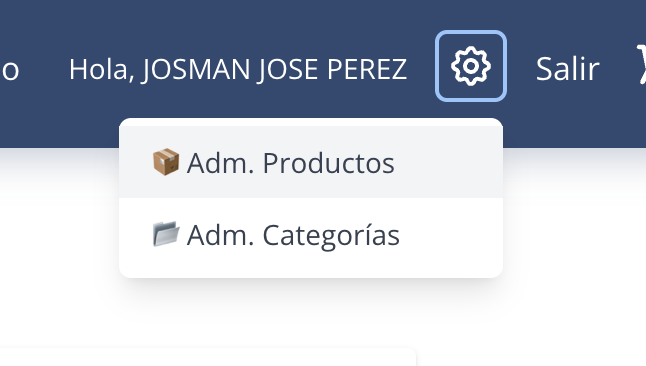

#### **Administración de Productos**

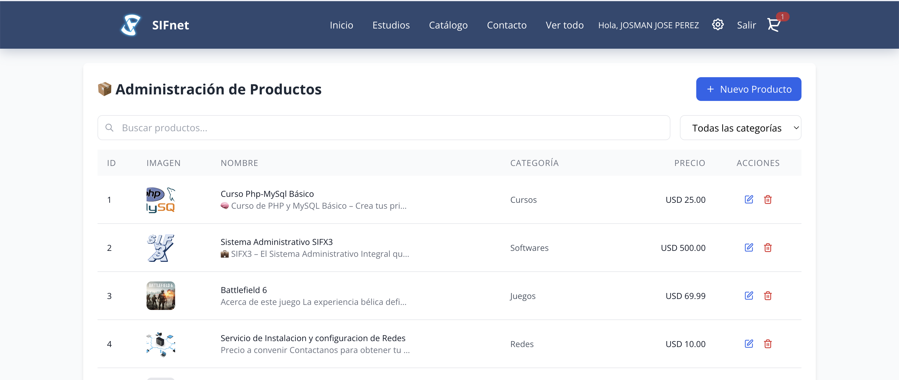

**Funcionalidades**:
- **Crear Productos**: Formulario completo con imagen
- **Editar Productos**: Modificación de datos existentes
- **Eliminar Productos**: Eliminación con confirmación
- **Búsqueda y Filtros**: Por nombre y categoría
- **Paginación**: Navegación eficiente de grandes listas.

- **Vista Responsive**: Tabla para escritorio, tarjetas para móvil

**Validaciones**:
- Nombre mínimo 10 caracteres
- Descripción mínimo 10 caracteres
- Precio mayor a cero
- Categoría obligatoria

#### **Administración de Categorías**

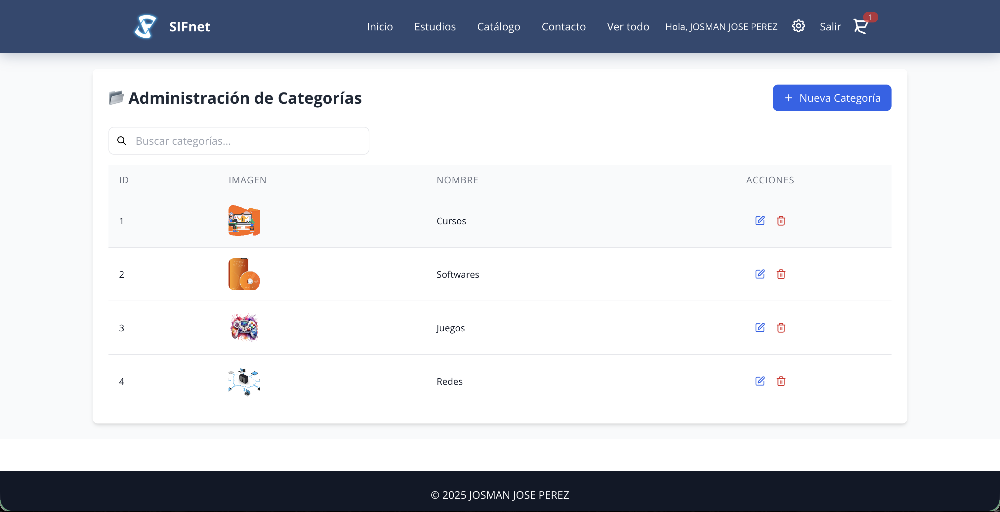

**Funcionalidades**:
- **Crear Categorías**: Nombre e imagen
- **Editar Categorías**: Modificación completa
- **Eliminar Categorías**: Con validación de productos asociados
- **Búsqueda**: Por nombre de categoría
- **Vista Responsive**: Adaptada para todos los dispositivos

### 📱 **Experiencia Móvil**

**Optimizaciones**:
- **Menú Hamburguesa**: Navegación táctil optimizada
- **Carrusel Móvil**: Un producto por vista en dispositivos pequeños
- **Formularios Adaptados**: Campos optimizados para touch
- **Botones de Acción**: Tamaño apropiado para dedos
- **Tablas Responsivas**: Conversión a tarjetas en móvil

### ♿ **Características de Accesibilidad**

**Navegación por Teclado**:
- Todos los elementos interactivos son accesibles via Tab
- Indicadores visuales de focus
- Navegación lógica y secuencial

**Screen Readers**:
- ARIA labels descriptivos
- Roles semánticos apropiados
- Alt text en todas las imágenes
- Estructura de headings jerárquica

**Preferencias de Usuario**:
- Soporte para `prefers-reduced-motion`
- Alto contraste cuando se requiere
- Texto escalable y legible

---

## ⚙️ Configuración Avanzada

### 🌍 **Configuración de Moneda**

Modifica las variables en `.env`:

```env
VITE_CURRENCY=EUR          # Código de moneda
VITE_CURRENCY_SYMBOL=€     # Símbolo a mostrar
```

### 🔗 **Configuración de API**

```env
VITE_API_URL=https://tu-api.com/api
```

### 📞 **Configuración de WhatsApp**

Modifica el número en `src/utils/api.js`:

```javascript
const url = `https://wa.me/TU_NUMERO?text=${text}`
```

---

## 🚀 Scripts Disponibles

```bash
npm run dev      # Servidor de desarrollo
npm run build    # Construcción para producción
npm run preview  # Vista previa de build
npm run lint     # Análisis de código con ESLint
```

---

## 🔧 Solución de Problemas

### **Error de Dependencias**
```bash
npm install --legacy-peer-deps
```

### **Error de Permisos en macOS/Linux**
```bash
sudo npm install
```

### **Puerto en Uso**
El servidor intentará usar el puerto 5174 si 5173 está ocupado.

### **Variables de Entorno No Cargadas**
Asegúrate de que las variables comiencen con `VITE_`.

---

## 🤝 Contribución

1. Fork el proyecto
2. Crea una rama para tu feature (`git checkout -b feature/nueva-funcionalidad`)
3. Commit tus cambios (`git commit -m 'Agregar nueva funcionalidad'`)
4. Push a la rama (`git push origin feature/nueva-funcionalidad`)
5. Abre un Pull Request

---

---

## 👥 Autor

**JOSMAN JOSE PEREZ**
- Email: josmanjp@gmail.com
- GitHub: [@josmanjp](https://github.com/josmanjp)

---

## 🆘 Soporte

Si encuentras algún problema o necesitas ayuda:

1. Revisa la documentación completa
2. Busca en los issues existentes de GitHub
3. Crea un nuevo issue con detalles del problema
4. Incluye información del sistema y pasos para reproducir el error

---

*Última actualización: Diciembre 2025*
